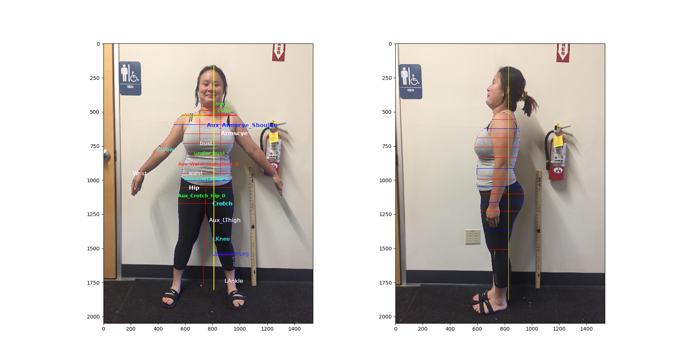
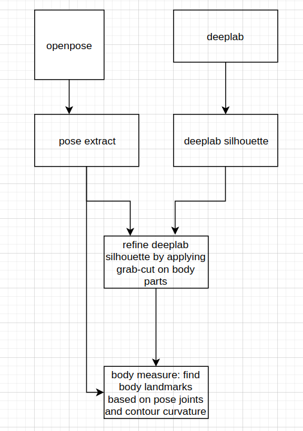

# set up environment
  * clone the code
    * git clone https://github.com/khanhha/body_measure.git
  * OpenPose
    * move to the folder body_measure
    * clone OpenPose to the same folder
        * git clone https://github.com/CMU-Perceptual-Computing-Lab/openpose
        * follow this instruction to build OpenPose on  Linux 
           https://github.com/CMU-Perceptual-Computing-Lab/openpose/blob/master/doc/installation.md
      * Note: 
      I recommend NOT building OpenPose INSIDE an Anaconda environemnt.
      I tried to do it for a few days but no luck. 
      Even I was able to build it, there're still run-time error due to library conflict.
      OpenPose should be built using native Python on OS and other OS libraries.

  * create anaconda environment
  
        conda create -n body python=3.5
        conda activate body
        conda install -c conda-forge opencv
        conda install tensorflow-gpu shapely matplotlib pillow

# run the code step by step

* activate conda environment

        cd ./body_measure/src
        conda activate body

* extract pose: 
    - this program uses OpenPose to calculate pose, which consists of joint positions and output data to the ouput folder. This module just requires openpose and opencv
    
    - run: pose_extract.py -i ../data/images -o ../data/pose
    - check the folder ../data/pose for visualization

- extract silhouette: 
    - This program first downloads a Deeplab model, loads it to tensorflow to extract silhouette. Unfortunately, the deeplab silhouete often doesn't fit to the real human contour. To solve it, we refine deeplab contour by applying grab-cut on human body parts independently. To apply grab-cut on each body part, we need two information:
        -  a local window around each body part: it is calculated from the pose of each body part. 
        -  the sure foreground mask and sure background mask: 
            -  the sure foreground mask for grab-cut operations is calcualted by dilating skeleton adaptively.
            -  the sure background mask is calculated by dilating the deepsilhouette with window size of 15

    - run: silhouette.py -i ../data/images/ -p ../data/pose/ -o ../data/silhouette/

    - check the fodler ../data/silhouette for visualization

* extract body slices and measurement: 
	* this program uses the refined silhouette and pose information to calculate body slices. For example, the shoulder landmarks are estimated from the shoulder joints in the front image, or the bust landmarks are estimated based on the contour curvature in the side image.
	  
    * run:  body_measure.py -i ../data/images -s ../data/silhouette -po ../data/pose -pa ../data/front_side_pair.txt 
      -o ../data/measurement
    * check the folder ../data/measurement for visualization

# run all in one on a single image
* run: body_measure_util.py -f ../data/images/IMG_1928_front_.JPG -s ../data/images/IMG_1928_side_.JPG -h_cm 165 
    -o ../data/measurement/
* check the folder ../data/measurement for visualization

# visualize and interpret data
* this program draws slices calculated from the previsous steps on front and side images.
and print out width and depth of 2d slices in centimet.
* please check the code for information about the output data format

* note: for some measuremetn like neck, collar, wrist, etc, we can only extract their width from front image. their  
depth values are not available and printed out as -1

* run: viz_measurement_result.py -f ../data/images/IMG_1928_front_.JPG -s ../data/images/IMG_1928_side_.JPG -d            
    ../data/measurement/IMG_1928_front_.npy
